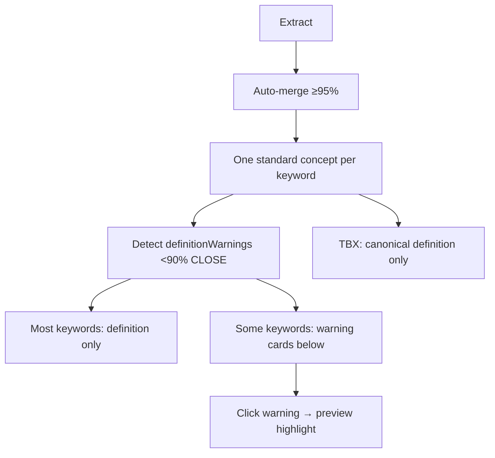

# Curation UX refinement — warnings, not actions

## Problem

Phase 2 introduced **"Official"**, **Outliers**, **Branch**, and **Ignore** — framing that treats divergent definitions as separate categories requiring curator action. The intended model is simpler:

- **One keyword group = one standard concept** (always), with merged definition
- Same-keyword figures that aren't semantically CLOSE are **informational warnings** about possible wrong source terminology in the document — not a separate workflow
- Click warning → highlight in preview (already wired via `onOutlierClick`)
- TBX exports **only the standard definition**; warnings are not exported

---

## Target UX

```
bracket
3 figures

Definition                         CLOSE
"Structural bracket for engine mount..."

Provenance
12.1 · callout 19
18.1 · callout 4

┌─ Terminology warning ─────────────────────────┐
│ Page 25.1 · callout 7                         │
│ "Flexible hose adapter..."                      │
│ This definition differs from the group. The     │
│ source term «bracket» may not apply here —      │
│ consider a more specific term for this figure.  │
└─────────────────────────────────────────────────┘
(click card → scroll + highlight in preview)
```

No section headers named "Official" or "Outliers". No Branch / Ignore buttons. Header shows **figure count only**, not concept count.

Sidebar: amber indicator = **has terminology warnings** (informational), not "Review outliers".

---

## Backend changes

### 1. Rename API shape — [`keywordCurationService.ts`](backend/src/services/keywordCurationService.ts)

| Old field | New field |
|-----------|-----------|
| `canonicalConcept` | `concept` |
| `outliers` | `definitionWarnings` |
| `hasPendingReview` | `hasDefinitionWarnings` |

`definitionWarnings[]` keeps: `pageNumber`, `figureNumber`, `identifiers`, `definitionText`, `cohesionRating` — drop user-action fields from response (`excludedFromExport` optional/internal).

Update [`splitCurationState`](backend/src/services/keywordCurationService.ts): warnings = non-canonical concepts OR canonical figures with rating !== CLOSE (unchanged detection logic at 90% threshold).

### 2. Remove auto-ignore from pipeline

Delete or stop calling:
- `applyOutlierAutoIgnore` / `applyOutlierAutoIgnoreForProject` in [`processingService.ts`](backend/src/services/processingService.ts) and [`projects.ts`](backend/src/routes/projects.ts) auto-merge route

Warnings are informational; no `excludedFromExport` mutation on outlier concepts.

### 3. TBX: one concept per keyword — [`tbxExportService.ts`](backend/src/services/tbxExportService.ts)

User confirmed: export **canonical/standard definition only**.

In `loadProjectTbxData`, for each keyword with linked concepts, use `pickCanonicalConceptForKeyword` (from curation/merge service) and export **one termEntry** per keyword group — skip non-canonical concepts even if `excludedFromExport` is false.

### 4. Deprecate unused action endpoints (frontend stops calling)

Keep routes for now but remove UI wiring:
- `POST /keywords/:id/branch`
- `POST /keywords/:id/concepts/:conceptId/ignore`

Optional cleanup ticket: delete dead code later.

### 5. Update tests

- [`keywordCuration.test.ts`](backend/tests/keywordCuration.test.ts) — rename fields, remove auto-ignore tests if any
- Add/adjust TBX test: keyword with 2 concepts exports 1 termEntry (canonical)

---

## Frontend changes

### 1. [`KeywordCurationPanel.tsx`](frontend/src/components/KeywordCurationPanel.tsx)

**Remove:**
- "Official" heading, "Outliers" section heading
- Ignore button + `ConfirmPromptModal` for ignore
- Branch button + branch modal
- "Ignored from export" badges
- Props: `onIgnoreConcept`, `onBranchConcept`, `isIgnoring`, `isBranching`

**Keep / add:**
- Single card: **Definition** + cohesion badge + read-only text + **Provenance** list (all CLOSE figures / canonical figures)
- Below card: **`definitionWarnings`** as amber warning containers (one per figure)
- Warning copy: suggest checking whether source term applies; click → `onWarningClick` (rename from `onOutlierClick`)
- No action buttons on warnings

### 2. [`KeywordDocumentView.tsx`](frontend/src/components/KeywordDocumentView.tsx)

- Update types to match renamed API fields
- Header: `{figureCount} figure(s)` only — remove "1 official concept", "Review outliers"
- Remove `handleIgnoreConcept`, `handleBranchConcept`, related state
- Keep `handleOutlierClick` → rename `handleWarningClick` (locate + highlight)

### 3. [`Dashboard.tsx`](frontend/src/pages/Dashboard.tsx)

- Rename `pendingReviewByKeyword` → `warningsByKeyword`
- Sidebar badge: amber dot + **"Warning"** (or tooltip "Terminology warning") instead of "Review"
- Update curation-summary consumption

### 4. Update ticket [`39. keyword-curation-workflow-phase-2.md`](docs/tickets/39. keyword-curation-workflow-phase-2.md) with refinement notes

---

## Data flow (unchanged detection, simplified presentation)



---

## Out of scope

- Definition editing
- Branch/ignore user actions
- Renaming internal DB `Concept` model

---

## Manual test plan

1. Keyword with all CLOSE definitions — single definition card, no warnings, no sidebar badge
2. Keyword with one divergent figure — warning card below definition; click → preview highlights
3. Header shows figure count only, no "official" or concept count
4. TBX export for keyword with warnings — only standard definition appears
5. Re-extract / auto-merge — warnings appear without concepts being auto-excluded
