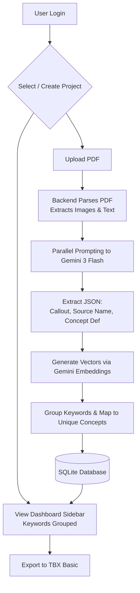

# MVP Implementation Proposal

**Goal:** Sketch the MVP implementation workflow, encompassing user authentication, project management, AI-powered terminology extraction from PDFs, and TBX Basic export.

**Context/Tech Stack:** React (Vite), Express.js (Node), SQLite (Prisma), Gemini 3 Flash (for vision/extraction), Gemini Embedding API (for vector similarities).

---

## 1. Overall Goal & Scope
The core feature of this MVP is to allow users to log in, create a project, and upload a PDF. The backend will parse the PDF illustrations and surrounding text, ping Gemini 3 Flash in parallel to generate callout-based terminology concepts, and store these concepts and their vector embeddings. 

**Core Workflow:**
1. **Auth:** Username/password login (no password resets).
2. **Dashboard:** 
   - Left sidebar showing identified keyword terms for the selected project.
   - Upper-left pane to switch projects.
   - Header button to "Create new terminology project".
   - First project auto-selected by default.
3. **Extraction & Processing:**
   - PDF upload parses document into illustrations and text context.
   - AI parallel processing extracts: Callouts + Name (Source Term) + Concept Definition.
4. **Data Aggregation & Export:**
   - Term concepts are embedded using Gemini's latest embedding model.
   - Grouping of terms into unique concept definitions.
   - Export terminology to **TBX Basic** format, adopting the structure from `translate-bot`.



## 2. Discussion: Challenges & Solutions

### A. Database Structure (Users -> Projects -> Keywords -> Concepts)
To support the TBX and MVP requirements, concepts must be unique via string definitions. 
*   **Users:** Handles auth.
*   **Projects:** Partitions terminology per uploaded document set.
*   **Keywords (Source Terms):** E.g., "bracket", "cover". Acts as the grouping node.
*   **Concepts:** The unique definition (e.g., "Rigid structural component"). String-based uniqueness ensures identical AI outputs collapse into a single concept.

```mermaid
erDiagram
    USER ||--o{ PROJECT : owns
    PROJECT ||--o{ KEYWORD : contains
    PROJECT ||--o{ CONCEPT : contains
    KEYWORD ||--o{ CONCEPT : maps_to
    
    USER {
        String id
        String username
        String passwordHash
    }
    PROJECT {
        String id
        String name
        String userId
    }
    KEYWORD {
        String id
        String sourceTerm
        String projectId
    }
    CONCEPT {
        String id
        String definitionHash UNIQUE
        String candidateConceptName
        String definitionText
        String vectorEmbedding
        String projectId
    }
```
*Challenge:* SQLite does not natively support advanced vector indexing like `pgvector` without extensions.
*Solution:* For the hackathon MVP, we will stick with SQLite for speed of development. We will store the vector embedding as a JSON serialized `Float[]` string in a `TEXT` column. Since hackathon data sizes are small (a few hundred terms per project), we can load the vectors into Node.js memory and calculate cosine similarity directly in the backend code. This saves us hours of infrastructure setup while still delivering the core value.

### B. PDF Parsing & Parallel AI
*Challenge:* Extracting images and text coordinates from PDFs to feed Gemini 3 Flash can be complex.
*Solution:* Use a robust Node PDF parsing library (like `pdf2pic` or `pdfjs-dist`) to convert pages to images, then pass the base64 images directly to Gemini 3 Flash with instructions to identify callouts.

### C. TBX Export
*Solution:* Adopt the XSLT and XML structures from `translate-bot` (`TBXBasicRNGV02`). The backend will query `Concepts` -> `Keywords` and format them into `<termEntry>` and `<tig>` blocks, responding with a downloadable `.tbx` file.

## 3. PR Implementation Plan

- **PR 1: Core Auth & Project DB:** 
  - **Goal:** Implement Prisma schema, User login routes, and basic Project CRUD.
  - **Scope:** Auth Context in React, Express Login/Register endpoints, Sidebar UI.
  - **Test Criteria:** User can register, login, create project, and see it in the UI.

- **PR 2: PDF Upload & Gemini Flash Parsing:**
  - **Goal:** Endpoint to accept PDF, extract images, and prompt Gemini 3 Flash.
  - **Scope:** Multer upload, PDF to Image conversion, Google AI SDK integration, returning raw JSON callouts.
  - **Test Criteria:** Uploading a PDF successfully logs extracted definitions in the terminal.

- **PR 3: Database Aggregation & Embeddings:**
  - **Goal:** Take Gemini Flash output, generate embeddings, and store unique Concepts.
  - **Scope:** Gemini Embedding API integration, grouping logic by Keyword, saving to SQLite.
  - **Test Criteria:** Sidebar correctly populates with Grouped Keywords -> Concepts after upload.

- **PR 4: TBX Basic Export:**
  - **Goal:** Generate TBX Basic compliant XML from the project database.
  - **Scope:** XML building logic (adopting from `translate-bot`), download endpoint.
  - **Test Criteria:** Exported `.tbx` file validates against `TBXBasicRNGV02.rng`.

---
STATUS: SPECIFICATION